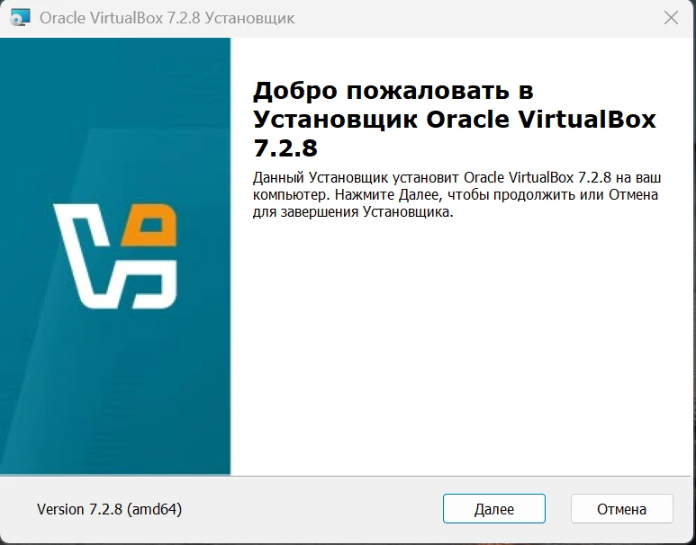
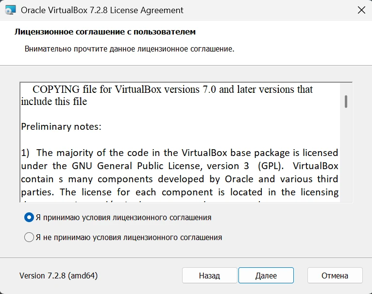

# Лабораторная работа 4. Знакомство с Linux.
## Задание 1. Выбор варианта
```
ser17@WIN-GCHLLJVFKQQ:~/project-1/labs/strpo/lab4$ echo "Шальных Виктория Артемовна" | md5sum
e766dfa9aebd9eee8a89c45e86e28ea5  -
```
Первый символ - E, так что я выбрала Zorin OS (простой вариант). А платформа виртуализации - VirtualBox. 

## Задание 2. Изучение особенностей дистрибутива
### 1.
* Дистрибутив разрабатывается и поддерживается небольшой ирландской компанией Zorin Group. В отличие от гигантов вроде Microsoft, это небольшая команда, которая создала Zorin OS как удобную альтернативу Windows.

* Zorin OS не является полностью самостоятельной системой. Он построен на основе Ubuntu.

* Небольшие обновления выходят примерно каждые 6 месяцев. А полноценные новые версии примерно раз два года.

* Есть официальная справка - help.zorin.com. Так же есть форум - forum.zorin.com - для обсуждения проблем и обмена опытом.

### 2.
Zorin OS, будучи основанным на Ubuntu, использует тот же основной пакетный менеджер, что и он - APT. Искать, устанавливать, обновлять и удалять можно через терминал или через графический "Магазин приложений". Так же Zorin OS поддерживает и другие форматы, что расширяет доступный ассортимент программ. 

### 3.
Процесс установки Zorin OS сделан очень простым. Для этого нужно скачать образ, создать загрузочную флешку, загрузиться с флешки, запустить установку, все настроить и перезагрузиться. 

### 4.
В плане системных требований Zorin OS довольно лояльный.
* Центральный процессор: 64-битный (x86) с частотой 1 ГГц.

* Оперативная память: 2 ГБ

* Место на диске: 15 ГБ.

## Задание 3. Установка ОС
Последовательность установки Virtual Box:




