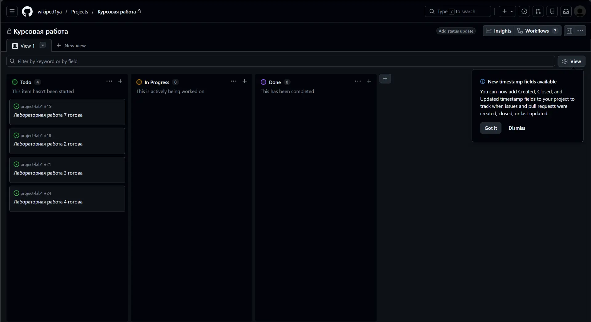
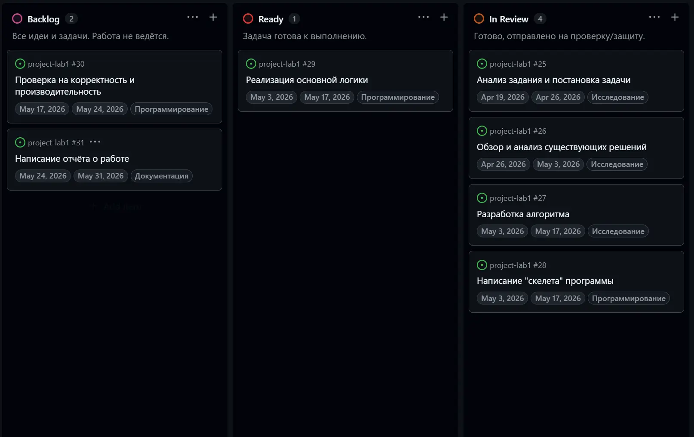
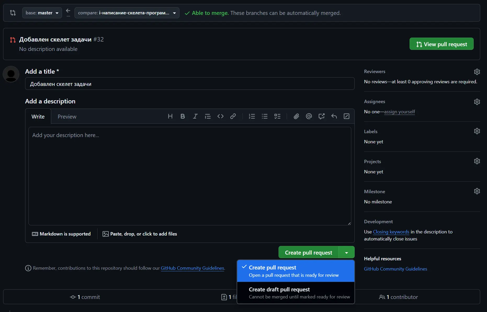

# Лабораторная работа 5. Средства управления проектами.
## Задание 1. Создание и настройка проекта
### 1.
Для создания проекта, посвященного курсовой, я перешла в раздел Project на GitHub. Создала новый проект, выбрала шаблон Board, так как там уже есть колонки Todo, In progress, Done. Затем я добавила преподавателя в коллабораторы. 


### 2.
Я добавила три новые колонки: Backlog, Ready, In Review. Попробовала написать в колонки некоторые задачи, которые у меня встречались при выполнении курсовой по СТРПО, чтобы увидеть как это работает.

### 3.
Для отображения новых полей я переключилась на режим Table. Затем нажала на кнопочку New и выбрала New filed. Назвала поле Start date и выбрала тип Date. Аналогично для Target date.

### 4.
Для этого подойдет тип Single select. Я аналогично предыдущему пункту создала новое поле Type. В отдельном поле добавила типы: Исследование, Документация, Программирование.

## Задание 2. Планирование работ по курсовой работе
### 1.
Я решила добавить следующие задачи:
* Анализ задания и постановка задачи
* Обзор и анализ существующих решений
* Разработка алгоритма
* Написание "скелета" программы
* Реализация основной логики
* Проверка на корректность и производительность
* Написание отчёта о работе

### 2.
Я добавила задачи в соответствующие колонки, затем, нажав на них, в выпавшем окошке настроила их параметры.


### 3.
Для задания связей между задачами я поставила блокировки на некоторые из них, чтобы задачу нельзя было закрыть, пока открыта связанная с ней задача. Для этого я открыла карточку задачи, в разделе Relationships выбрала Blocked by и выбрала нужную задачу. 

## Задание 3. Выполнение задачи
### 1.
В боковой панели задачи я нашла раздел Development, нажала Create a branch и создала ветку.
```
git fetch origin
git checkout i-написание-скелета-программы
```

В новой ветке я добавила папку с файлом, содержащим словестное описание скелета программы. Затем загрузила его на Git Hub.
```
ser17@WIN-GCHLLJVFKQQ:~/project-1/labs/strpo/lab5$ git add docs/programma.md
ser17@WIN-GCHLLJVFKQQ:~/project-1/labs/strpo/lab5$ git commit -m "Добавлен скелет задачи"
[i-написание-скелета-программы 039597a] Добавлен скелет задачи
 1 file changed, 37 insertions(+)
 create mode 100644 labs/strpo/lab5/docs/programma.md
ser17@WIN-GCHLLJVFKQQ:~/project-1/labs/strpo/lab5$ git push origin i-написание-скелета-программы
Enumerating objects: 10, done.
Counting objects: 100% (10/10), done.
Delta compression using up to 18 threads
Compressing objects: 100% (5/5), done.
Writing objects: 100% (7/7), 1.52 KiB | 780.00 KiB/s, done.
Total 7 (delta 1), reused 0 (delta 0), pack-reused 0
remote: Resolving deltas: 100% (1/1), completed with 1 local object.
To github.com:wikiped1ya/project-lab1.git
   e7cc112..039597a  i-написание-скелета-программы -> i-написание-скелета-программы
```

Потом я создала черновой PR.


### 2.
Добавила преподавателя ревьюером и прикрепила PR к Issue: Closes #28.

### 3.
Уже выполненные задачи я переместила в колонку Done. Задача, к которой я создавала PR, переместилась в колонку In Progress. Остальные задачи пока остаются на своих местах в колонках Ready и Backlog.

### 4.
С помощью кнопочки Ready for review, я перевела черновой запрос на слияние в готовый.

### 5.
Пока что запрос на слияние остается актуальным. (Поскульку этот вопрос задавался на паре, и вы разрешили, я уже выполнила слияние и закрыла PR)

## Задание 4. Исследование альтернатив
### 1.
Вот альтернативы, которые я смогла найти:
* GitLab - Бесплатная облачная версия имеет ограничения (5 пользователей, 400 CI-минут)
* OpenProject - Community Edition требует самостоятельной настройки сервера; облачная версия — платная
* OneDev - Требует Java (JVM), менее известен и распространён
* Codeberg - Ресурсы ограничены (1 ГБ на репозиторий), интерфейс минималистичнее

### 2.
Я выбрала GitLab. Многие его принципы работы очень похожи. 
* Для создания и настройки проекта нужно было бы создать отдельный репозиторий, отдельную доску. GitLab объединяет репозиторий и инструменты для планирования. Достаточно создать только проект.

* Планирование работ (типы задач, сроки). Вместо отдельных полей Тип работы в GitLab используют метки Labels. 

* Для сроков (начала и окончания) в GitLab есть вехи (Milestones) . Можно создать веху Курсовая работа и указать ей даты.

* Для PR есть аналог Merge Request. Так же можно создать черновик, добавить ревьюера и связать с задачей. 

* Для отслеживания статуса задачи есть доска Issue Board. Работа с ней схожа на работу в GitHub.


